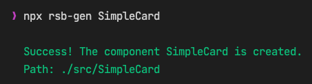

# rsb-gen

```
npx rsb-gen ComponentName
```

By default a folder with the react component and the matching story will be created under /src. But the component path can be specified as second argument.

```
npx rsb-gen SimpleCard components/cards
```

### Sample output


